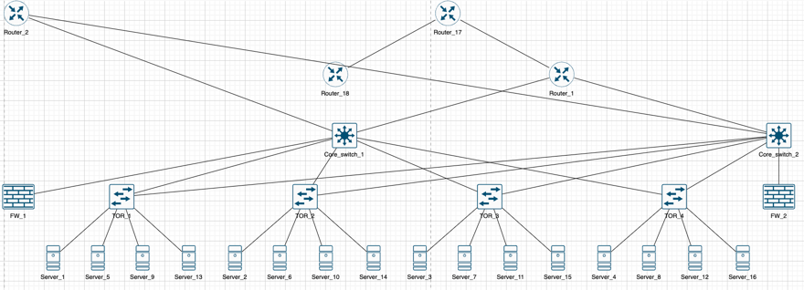

# drawio_network_plot
## Overview
- Package is mainly created for Network Automation , can be used in conjunction with other libraries to generate DrawIO plot for your Network (Service Provider ot Data Centter Network).
- Available devices : Router , L3_Switch , L2_switch , Firewall , Server ( More to be added )
- Output generated can be directly opened by DrawIO application (Desktop or Web version)

## Understanding the logic 
The "NetPlot" class is itself the plot , you initiate it and then you can do the following : 
- Add a Node or a Nodes list .
- Add an Edge or a list of Edges .
>Note : the edges has Source and Destination nodes , better to always put the Parent device in the Source node and the Child node in the Destination node , this will affect the way DrawIO does automatic Layouts .

## Examples
### Example 1 : Datacenter Plot 
this example demonstrates how to use both the addition of object or list of objects at once : 

```python

from drawio_network_plot import NetPlot

device_list = [
                # Routers
                {'nodeName' : 'Router_1','nodeType' : 'router','nodeDescription' : 'External Peering Provider 1'},
                {'nodeName' : 'Router_2','nodeType' : 'router','nodeDescription' : 'External Peering Provider 2'},
                # Core
                {'nodeName' : 'Core_switch_1','nodeType' : 'l3_switch','nodeDescription' : 'Spine Switch 01'},
                {'nodeName' : 'Core_switch_2','nodeType' : 'l3_switch','nodeDescription' : 'Spine Switch 02'},
                # Firewalls
                {'nodeName' : 'FW_1','nodeType' : 'firewall','nodeDescription' : 'Firewall 01'},
                {'nodeName' : 'FW_2','nodeType' : 'firewall','nodeDescription' : 'Firewall 02'},
                # Leafs
                {'nodeName' : 'TOR_1','nodeType' : 'l2_switch','nodeDescription' : 'Leaf Switch 01'},
                {'nodeName' : 'TOR_2','nodeType' : 'l2_switch','nodeDescription' : 'Leaf Switch 02'},
                {'nodeName' : 'TOR_3','nodeType' : 'l2_switch','nodeDescription' : 'Leaf Switch 03'},
                {'nodeName' : 'TOR_4','nodeType' : 'l2_switch','nodeDescription' : 'Leaf Switch 04'},
                # Servers 
                {'nodeName' : 'Server_1','nodeType' : 'server','nodeDescription' : 'Server 1'},
                {'nodeName' : 'Server_2','nodeType' : 'server','nodeDescription' : 'Server 2'},
                {'nodeName' : 'Server_3','nodeType' : 'server','nodeDescription' : 'Server 3'},
                {'nodeName' : 'Server_4','nodeType' : 'server','nodeDescription' : 'Server 4'},
                {'nodeName' : 'Server_5','nodeType' : 'server','nodeDescription' : 'Server 5'},
                {'nodeName' : 'Server_6','nodeType' : 'server','nodeDescription' : 'Server 6'},
                {'nodeName' : 'Server_7','nodeType' : 'server','nodeDescription' : 'Server 7'},
                {'nodeName' : 'Server_8','nodeType' : 'server','nodeDescription' : 'Server 8'},
                {'nodeName' : 'Server_9','nodeType' : 'server','nodeDescription' : 'Server 9'},
                {'nodeName' : 'Server_10','nodeType' : 'server','nodeDescription' : 'Server 10'},
                {'nodeName' : 'Server_11','nodeType' : 'server','nodeDescription' : 'Server 11'},
                {'nodeName' : 'Server_12','nodeType' : 'server','nodeDescription' : 'Server 12'},
                {'nodeName' : 'Server_13','nodeType' : 'server','nodeDescription' : 'Server 13'},
                {'nodeName' : 'Server_14','nodeType' : 'server','nodeDescription' : 'Server 14'},
                {'nodeName' : 'Server_15','nodeType' : 'server','nodeDescription' : 'Server 15'},
                {'nodeName' : 'Server_16','nodeType' : 'server','nodeDescription' : 'Server 16'},
              ]


connection_list = [
                    # Router to Core
                    {'sourceNodeID' : 'Router_1','destinationNodeID' : 'Core_switch_1'},
                    {'sourceNodeID' : 'Router_1','destinationNodeID' : 'Core_switch_2'},
                    {'sourceNodeID' : 'Router_2','destinationNodeID' : 'Core_switch_1'},
                    {'sourceNodeID' : 'Router_2','destinationNodeID' : 'Core_switch_2'},
                    # Core to FW 
                    {'sourceNodeID' : 'Core_switch_1','destinationNodeID' : 'FW_1'},
                    {'sourceNodeID' : 'Core_switch_2','destinationNodeID' : 'FW_2'},
                    # Core to TOR 
                    {'sourceNodeID' : 'Core_switch_1','destinationNodeID' : 'TOR_1'},
                    {'sourceNodeID' : 'Core_switch_1','destinationNodeID' : 'TOR_2'},
                    {'sourceNodeID' : 'Core_switch_1','destinationNodeID' : 'TOR_3'},
                    {'sourceNodeID' : 'Core_switch_1','destinationNodeID' : 'TOR_4'},
                    {'sourceNodeID' : 'Core_switch_2','destinationNodeID' : 'TOR_1'},
                    {'sourceNodeID' : 'Core_switch_2','destinationNodeID' : 'TOR_2'},
                    {'sourceNodeID' : 'Core_switch_2','destinationNodeID' : 'TOR_3'},
                    {'sourceNodeID' : 'Core_switch_2','destinationNodeID' : 'TOR_4'},
                    # TOR to Server 
                    {'sourceNodeID' : 'TOR_1','destinationNodeID' : 'Server_1'},
                    {'sourceNodeID' : 'TOR_2','destinationNodeID' : 'Server_2'},
                    {'sourceNodeID' : 'TOR_3','destinationNodeID' : 'Server_3'},
                    {'sourceNodeID' : 'TOR_4','destinationNodeID' : 'Server_4'},
                    {'sourceNodeID' : 'TOR_1','destinationNodeID' : 'Server_5'},
                    {'sourceNodeID' : 'TOR_2','destinationNodeID' : 'Server_6'},
                    {'sourceNodeID' : 'TOR_3','destinationNodeID' : 'Server_7'},
                    {'sourceNodeID' : 'TOR_4','destinationNodeID' : 'Server_8'},
                    {'sourceNodeID' : 'TOR_1','destinationNodeID' : 'Server_9'},
                    {'sourceNodeID' : 'TOR_2','destinationNodeID' : 'Server_10'},
                    {'sourceNodeID' : 'TOR_3','destinationNodeID' : 'Server_11'},
                    {'sourceNodeID' : 'TOR_4','destinationNodeID' : 'Server_12'},
                    {'sourceNodeID' : 'TOR_1','destinationNodeID' : 'Server_13'},
                    {'sourceNodeID' : 'TOR_2','destinationNodeID' : 'Server_14'},
                    {'sourceNodeID' : 'TOR_3','destinationNodeID' : 'Server_15'},
                    {'sourceNodeID' : 'TOR_4','destinationNodeID' : 'Server_16'},               
                ]
# Initiating an Plot instance 
x = NetPlot()
# Adding node by node and edge by edge
x.addNode(nodeName='Router_17',nodeType='router')
x.addNode(nodeName='Router_18',nodeType='router')
# Adding lists of nodes and edges 
x.addLink('Router_17','Router_18')
x.addLink('Router_17','Router_1')
x.addNodeList(device_list)
x.addLinkList(connection_list)

# Output 
# 1- using method "display_xml"
print(x.display_xml())
# 2- printing the class will automatically call the "display_xml" method
print(x)
# 3- Exporting to XML file directly
x.exportXML('examples/output.xml')

```

Output looks as follows :
